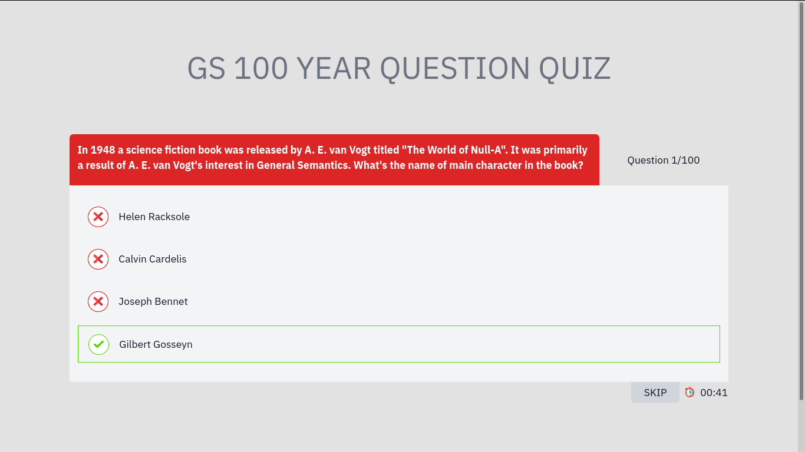
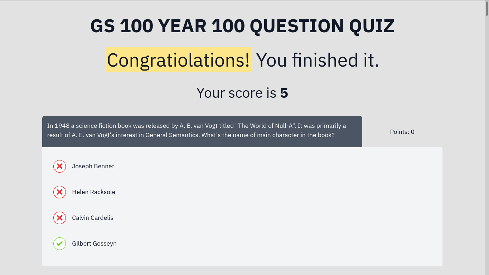

## Introduction

This is a quiz app I built for the organization I belong. The quiz supoorts both single answer and multi answer questions. It gives immediate feedback and at the end provides a detailed report of what went good and what went bad. Quiz is timed and every question gets 45s.




## Setup

Build application and upload dist/ to server root directory. You might also need to inform server about `.question` so to serv them as text/plain files.

For NGINX that would be

```
location ~ \.question$ {
        types { } default_type "text/plain; charset=utf-8";
        add_header x-robots-tag "noindex, follow";
}
```

## Introduction

This is a quiz app I built for the organization I belong. The quiz supoorts both single answer and multi answer questions. It gives immediate feedback and at the end provides a detailed report of what went good and what went bad. Quiz is timed and every question gets 45s.


## Setup

Build application and upload dist/ to server root directory. You might also need to inform server about `.question` so to serv them as text/plain files.

For NGINX that would be

```
location ~ \.question$ {
        types { } default_type "text/plain; charset=utf-8";
        add_header x-robots-tag "noindex, follow";
}
```

## Live

* http://quiz.generalsemantics.lt